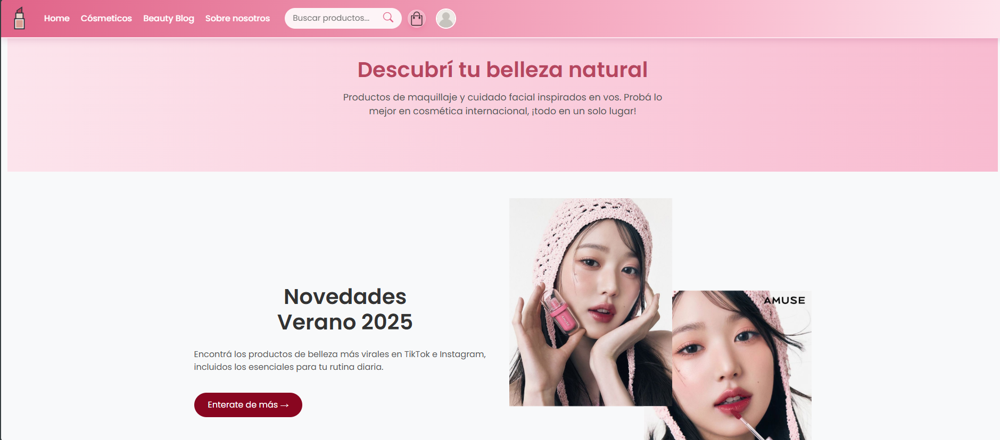
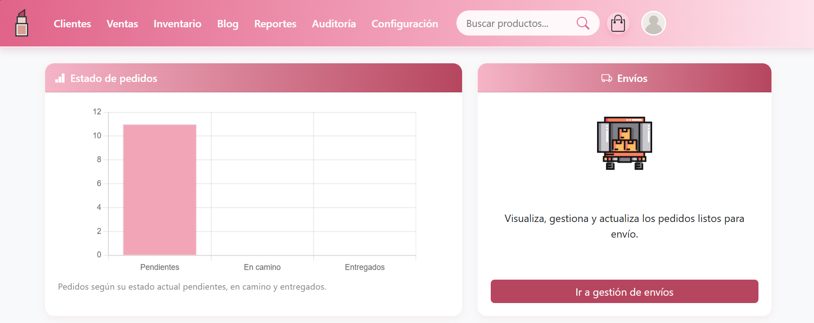
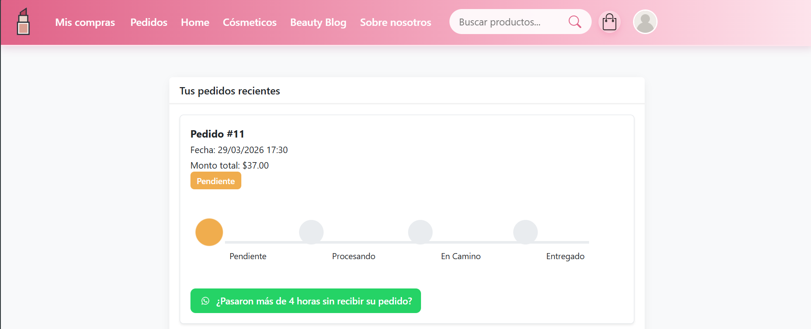
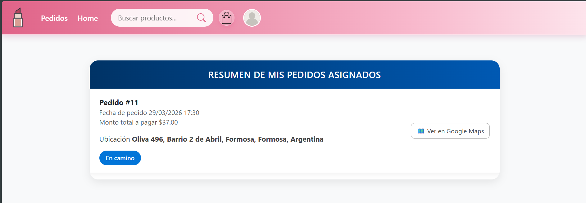
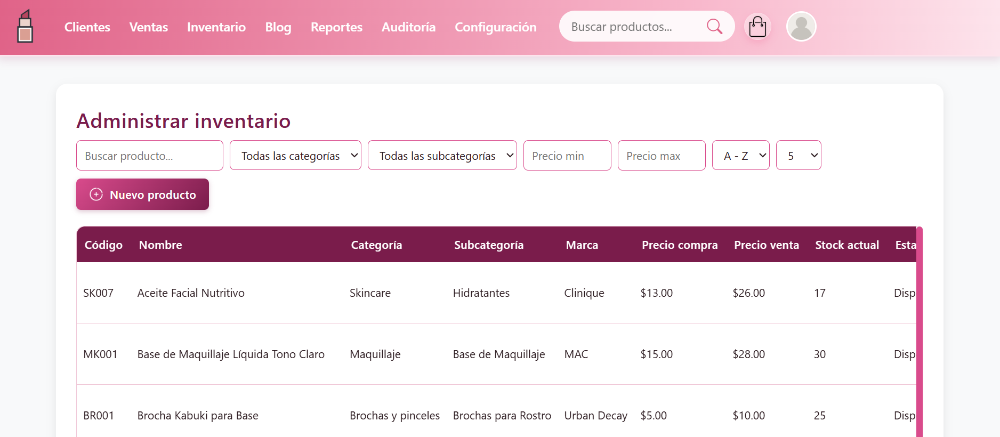
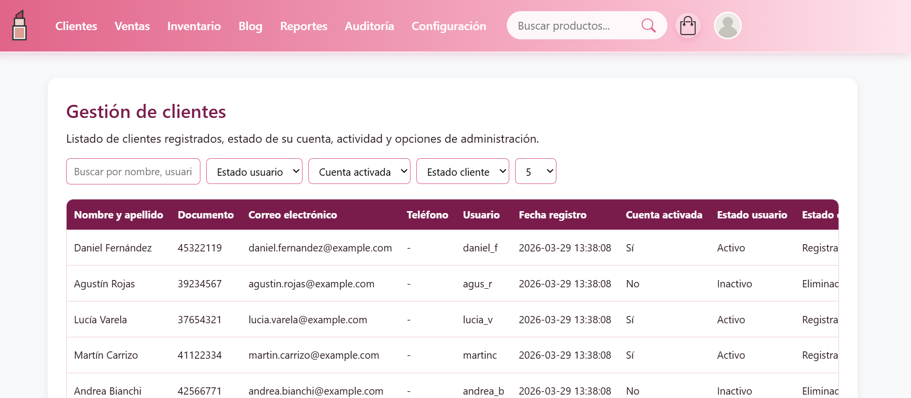
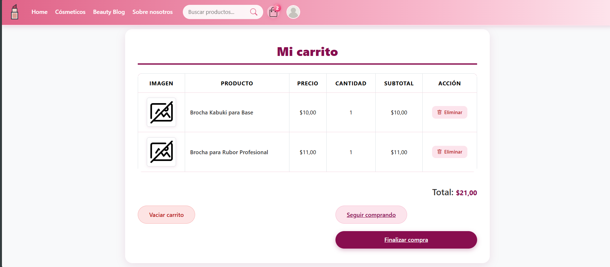
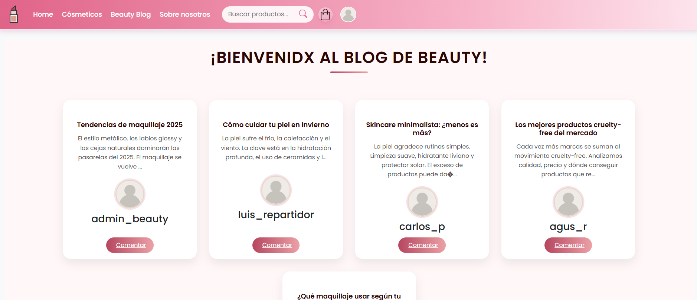
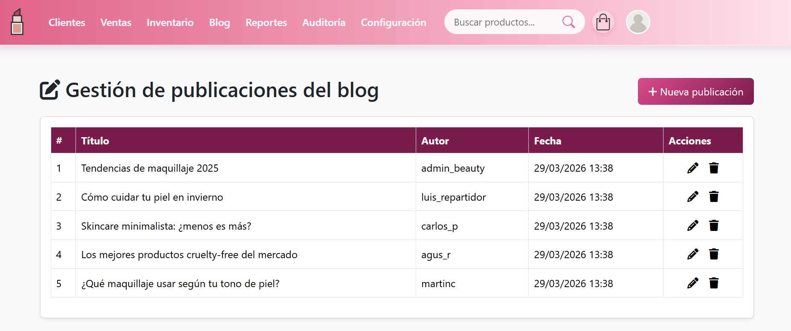
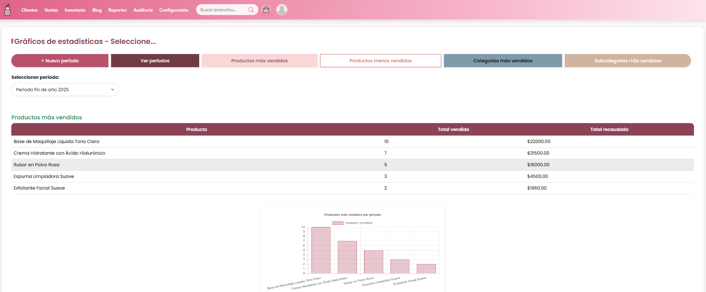

[EN] # BeautySystem is a full-featured e-commerce platform for cosmetics, developed using a custom MVC architecture in PHP.  
It provides a complete solution for managing products, customers, orders, payments, shipping, and content.

## Screenshots

### Home

### Admin Dashboard

### Customer Dashboard

### Delivery Dashboard

### Product Management

### Customer Management

### Shopping Cart

### Payment Confirmation

### Payment Receipt

### Shipping Confirmation

### Blog

### Blog Management

### Reports

### Project Structure

## Overview

This project was built as a complete web application without using frameworks, focusing on scalability, modularity, and clean architecture.

It includes real-world functionalities such as online payments, order management, PDF invoice generation, email notifications, shipping management, and a content blog.

## Features

- Product management (CRUD)
- Inventory control
- User authentication and registration
- Customer purchase history
- Online payments integration (Mercado Pago Checkout API)
- Shipping management (pending, in transit, delivered)
- PDF invoice generation (Dompdf)
- Email notifications (PHPMailer)
- User roles and administration
- Reports and audit system
- Interactive blog module

## Technologies Used

- PHP 8 (Custom MVC architecture)
- MySQL
- JavaScript (Fetch API)
- Composer
- Mercado Pago SDK
- PHPMailer
- Dompdf

## Project Structure

beauty-system/
├── assets/
├── controllers/
├── core/
├── database/
├── models/
├── views/
├── vendor/
├── screenshots/
├── .env
├── .env.example
├── composer.json
├── index.php

## Requirements

- PHP >= 8.0
- MySQL or MariaDB
- Composer
- Local server (XAMPP, Laragon or similar)

## Installation

1. Clone the repository
git clone https://github.com/ladardrgz/beauty-system.git
cd beauty-system

2. Install dependencies
composer install

4. Setup database
Create a database in MySQL
Import the SQL file:
database/beautysystem.sql

6. Configure environment variables

Copy the example file:
cp .env.example .env
Edit .env

5. Run the application
Place the project in your server directory (for example, htdocs) and access:
http://localhost/beauty-system/
Screenshots

Security
Sensitive data handled via environment variables
Secure payment integration
Session-based authentication
Notes
Built without frameworks to demonstrate architecture and design skills
Uses a modular MVC structure
Designed with scalability and maintainability in mind

Author: Lada Elizabet Rodriguez

[ES] BeautySystem es una plataforma completa de comercio electrónico para cosméticos, desarrollada con una arquitectura MVC personalizada en PHP.

Permite gestionar productos, clientes, pedidos, pagos online, envíos y contenido interactivo.

## Descripción

Este proyecto fue desarrollado como una aplicación web completa sin utilizar frameworks, enfocándose en:

- Escalabilidad
- Organización modular
- Buenas prácticas de desarrollo

Incluye funcionalidades reales como integración de pagos, generación de comprobantes PDF, envío de correos y gestión de envíos.

## Funcionalidades

- Gestión de productos (CRUD)
- Control de inventario
- Registro y autenticación de usuarios
- Historial de compras por cliente
- Integración de pagos online (Mercado Pago Checkout API)
- Gestión de envíos (pendiente, en camino, entregado)
- Generación de comprobantes PDF (Dompdf)
- Envío de correos (PHPMailer)
- Administración de usuarios y roles
- Reportes y auditoría
- Blog interactivo sobre cosméticos

## Tecnologías utilizadas

- PHP 8 (MVC personalizado)
- MySQL
- JavaScript (Fetch API)
- Composer
- Mercado Pago SDK
- PHPMailer
- Dompdf

## Estructura del proyecto
beauty-system/
├── assets/
├── controllers/
├── core/
├── database/
├── models/
├── views/
├── vendor/
├── screenshots/
├── .env
├── .env.example
├── composer.json
├── index.php

## Requisitos

- PHP >= 8.0
- MySQL o MariaDB
- Composer
- Servidor local (XAMPP, Laragon o similar)

---

## Instalación

1. Clonar el repositorio
git clone https://github.com/ladardrgz/beauty-system.git
cd beauty-system

2. Instalar dependencias
composer install

4. Configurar base de datos
Crear base de datos en MySQL
Importar el archivo:
database/beautysystem.sql

6. Configurar variables de entorno
cp .env.example .env

Editar .env:

5. Ejecutar la aplicación
Colocar el proyecto en el servidor local y acceder a:

http://localhost/beauty-system/
Capturas

Seguridad
Uso de variables de entorno para datos sensibles
Integración segura con servicios externos
Manejo de sesiones
Notas
Arquitectura MVC personalizada
Proyecto sin frameworks
Enfocado en buenas prácticas y escalabilidad

Autor: Lada Elizabet Rodriguez
